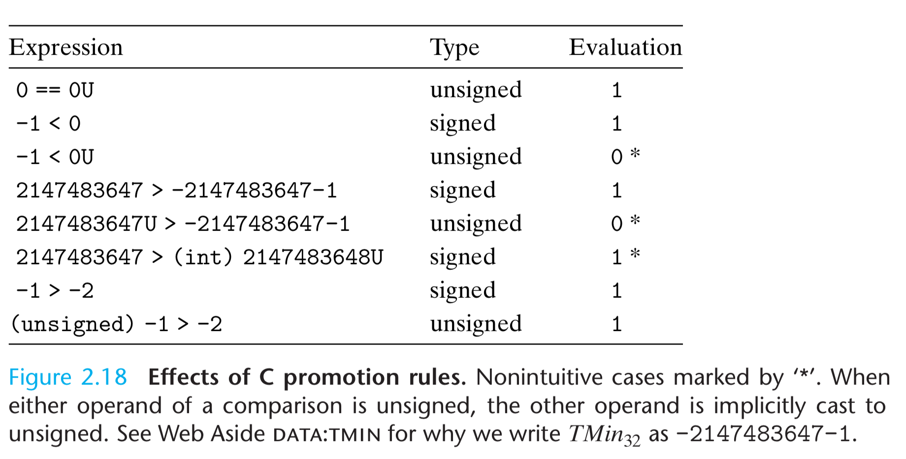

# Chapter 2 Representing and Manipulating Information

Using decimal notation is natural for ten-fingered humans, but binary values work better when building machines that store and process information. Two-valued signals can readily be represented, stored, and transmitted, for example, as the presence or absence of a hole in a punched card, as a high or low voltage on a wire, or as a magnetic domain oriented clockwise or counterclockwise.

Integer encoding can be unsigned or two's-complement. Some operations can overflow. On 32 bit system, `200 * 300 * 400 * 500` yields `−884,901,888`. Integer computer arithmetic satisfies many of the familiar properties of true integer arithmetic. For example, multiplication is associative and commutative.

Floating-point encodings are a base-two version of scientific notation for representing real numbers. The product of a set of positive numbers will always be positive, although overflow will yield the special value +∞. Floating-point arithmetic is not associative, due to the finite precision of the representation. For example, the C expression (3.14+1e20)-1e20 will evaluate to 0.0 on most machines, while 3.14+(1e20- 1e20) will evaluate to 3.14.

Integer representations can encode a comparatively small range of values, but do so precisely, while floating-point representations can encode a wide range of values, but only approximately.


```shell
$ gcc --version
Configured with: --prefix=/Applications/Xcode.app/Contents/Developer/usr --with-gxx-include-dir=/Applications/Xcode.app/Contents/Developer/Platforms/MacOSX.platform/Developer/SDKs/MacOSX.sdk/usr/include/c++/4.2.1
Apple clang version 11.0.0 (clang-1100.0.33.12)
Target: x86_64-apple-darwin18.7.0
Thread model: posix
InstalledDir: /Applications/Xcode.app/Contents/Developer/Toolchains/XcodeDefault.xctoolchain/usr/bin
$ bash TestCVersion.sh
c89
__STRICT_ANSI__

c99
__STDC_VERSION__ = 199901
__STRICT_ANSI__

c11
__STDC_VERSION__ = 201112
__STRICT_ANSI__

c17
__STDC_VERSION__ = 201710
__STRICT_ANSI__

gnu89

gnu99
__STDC_VERSION__ = 199901

gnu11
__STDC_VERSION__ = 201112

gnu17
__STDC_VERSION__ = 201710

default
__STDC_VERSION__ = 201112
```

## 2.1 Information Storage

Most computers use blocks of eight bits, or bytes, as the smallest addressable unit of memory. Every byte of memory is identified by a unique number, known as its address, and the set of all possible addresses is known as the virtual address space. As indicated by its name, this virtual address space is just a conceptual image presented to the machine-level program. The actual implementation uses a combination of random-access memory (RAM), disk storage, special hardware, and operating system software to provide the program with what appears to be a monolithic byte array.

The value of a pointer in C—whether it points to an integer, a structure, or some other program object—is the virtual address of the first byte of some block of storage. The C compiler also associates type information with each pointer, so that it can generate different machine-level code to access the value stored at the location designated by the pointer depending on the type of that value. Although the C compiler maintains this type information, the actual machine-level program it generates has no information about data types. It simply treats each program object as a block of bytes, and the program itself as a sequence of bytes.

### Hexadecimal Notation

For $x=2^n$, we write $n=i+4j$, where $0 \leq i \leq 3$, we write a leading hex digit of $1 (i = 0), 2 (i= 1), 4 (i=2), 8 (i=3)$, followed by $j$ hexadecimal $0$ s. For example, for $ x=2048= 2^{11}$, $n=11=3 + 4\cdot2$, hex representaton is $800$.

[Math equation wiki reference][1].

### Words

For a machine with a w-bit word size, the virtual addresses can range from $0$ to $2^w − 1$, giving the program access to at most $2^w$ bytes.

|word size|memory size|actual number|
|-|-|-|
|32 bit|4 Giga bytes|4,294,967,296|
|64 bit|18 Exa bytes|18,446,744,073,709,551,616|

### Data Sizes


### Addressing and Byte Odering

In virtually all machines, a multi-byte object is stored as a contiguous sequence of bytes, with the address of the object given by the smallest address of the bytes used. For example, suppose a variable x of type int has address 0x100, that is, the value of the address expression &x is 0x100. Then the 4 bytes of x would be stored in memory locations 0x100, 0x101, 0x102, and 0x103.

The former convention—where the least significant byte comes first—is referred to as **little endian**. This convention is followed by most Intel-compatible machines. The latter convention—where the most significant byte comes first—is referred to as **big endian**. This convention is followed by most machines from IBM and Sun Microsystems. Note that we said “most”. The conventions do not split precisely along corporate boundaries. For example, both IBM and Sun manufacture machines that use Intel-compatible processors and hence are little endian. Many recent microprocessors are bi-endian, meaning that they can be configured to operate as either little- or big-endian machines.


A common problem is for data produced by a little-endian machine to be sent to a big-endian machine, or vice versa, leading to the bytes within the words being in reverse order for the receiving program. To avoid such problems, code written for networking applications must follow established conventions for byte ordering to make sure the sending machine converts its internal representation to the network standard, while the receiving machine converts the network standard to its internal representation.


```bash
$ show-bytes.o
calling show_twocomp
 39 30
 c7 cf
Calling simple_show_a
 21
 21 43
 21 43 65
Calling simple_show_b
 78
 78 56
 78 56 34
Calling float_eg
# 21 bits match, from . to .
For x = 3490593
 21 43 35 00 # 0000 0000 001.1 0101 0100 0011 0010 0001.
 84 0c 55 4a #   0100 1010 0.101 0101 0000 1100 1000 01.00
For x = 3510593
 41 91 35 00
 04 45 56 4a
Calling string_ueg
 41 42 43 44 45 46
Calling string_leg
 61 62 63 64 65 66
 31 32 33 34 35 00
$ show-bytes.o 1
calling test_show_bytes
 01 00 00 00 # show int
 00 00 80 3f # show float
 98 d7 20 ef fe 7f 00 00 # show pointer
system call return code 0
0xFEDCBA98 << 32 ==  98 ba dc fe
0xFEDCBA98 >> 36 ==  a9 cb ed ff
0xFEDCBA98u >> 40 ==  ba dc fe ff
v=-12345, uv=53191
u=4294967295, tu=-1
x= 4294967295 = -1
u = 2147483648 = -2147483648
-1 < 0u is false
```

### 2.1.5 Representing Strings

### 2.1.6 Representign Code

```C
int sum(int x, int y) {
    return x + y;
}
```

|Machine|Compiled Code|
|-|-|
|Linux 32|55 89 e5 8b 45 0c 03 45 08 c9 c3|
|Windows|55 89 e5 8b 45 0c 03 45 08 5d c3|
|Sun|81 c3 e0 08 90 02 00 09|
|Linux 64|55 48 89 e5 89 7d fc 89 75 f8 03 45 fc c9 c3|

Different machine types use different and incompatible instructions and encodings. Even identical processors running different operating systems have differences in their coding conventions and hence are not binary compatible. Binary code is seldom portable across different combinations of machine and operating system.

### 2.1.7 Boolean Algebra

One useful application of bit vectors is to represent finite sets. We can encode any subset $A⊆\{0,1,...,w−1\}$ with a bit vector $[a_{w−1},...,a_1,a_0]$,where $a_i = 1$ if and only if $i ∈ A$. For example, recalling that we write $a_{w−1}$ on the left and $a_0$ on the right, bit vector `a = [01101001]` encodes the set `A = {0, 3, 5, 6}`, while bit vector `b = [01010101]` encodes the set `B = {0, 2, 4, 6}`. With this way of encoding sets, Boolean operations `|` and `&` correspond to set union and intersection, respectively, and `~` corresponds to set complement. Continuing our earlier example, the operation `a & b` yields bit vector `[01000001]`, while `A ∩ B` = `{0, 6}`.

### 2.1.8 Bit-Level Operation in C

One common use of bit-level operations is to implement masking operations. For example, with `x = 0x89ABCDEF`, `x & 0xFF` would yield `0x000000EF`. The expression ~0 will yield a mask of all ones, regardless of the word size of the machine. Although the same mask can be written `0xFFFFFFFF` for a 32-bit machine, such code is not as portable.

Practice Problem 2.12

Write C expressions, in terms of variable x, for the following values. Your code should work for any word size w ≥ 8. For reference, we show the result of evaluating the expressions for `x = 0x87654321`, with w = 32.

A. The least significant byte of x, with all other bits set to 0. [0x00000021].

Answer: `x & 0xFF`

B. All but the least significant byte of x complemented, with the least significant byte left unchanged. [0x789ABC21].

Answer: `x ^ ~ 0xFF`, me `~ x & 0xFF`

C. The least significant byte set to all 1s, and all other bytes of x left unchanged. [0x876543FF].

Answer: `x | 0xFF`

### 2.1.9 Logical Operation in C

A second important distinction between the logical operators `&&` and `||` versus their bit-level counterparts `&` and `|` is that the logical operators do not evaluate their second argument if the result of the expression can be determined by evaluating the first argument. Thus, for example, the expression `a && 5/a` will never cause a division by zero, and the expression `p && *p++` will never cause the dereferencing of a null pointer.

Practice Problem 2.15

Using only bit-level and logical operations, write a C expression that is equivalent to `x == y`. In other words, it will return 1 when x and y are equal, and 0 otherwise.

Answer: `!(x^y)`, `~(x^y)` incorrect, e.g., `~1` is not `0` but `0xFFFFFFFE` for 32 bit int.

### 2.1.10 Shift Operation in C

**Shift left**

For $x : [x_n−1, x_n−2, . . . , x_0]$, $x << k : [x_{n−k−1}, x_{n−k−2},...,x_0,0,...,0]$. That is, x is shifted k bits to the left, dropping off the k most significant bits and filling the right end with k zeros.

**Logical right shift**

Result is $[0, . . . , 0, x_{n−1}, x_{n−2}, ..., x_k]$

**Arithmetic right shift**

Result is $[x_{n−1}, . . . , x_{n−1}, x_{n−1}, x_{n−2}, ..., x_k]$

The C standards do not precisely define which type of right shift should be used. For unsigned data (i.e., integral objects declared with the qualifier unsigned), right shifts must be logical. For signed data (the default), either arithmetic or logical shifts may be used. This unfortunately means that any code assuming one form or the other will potentially encounter portability problems. In practice, however, almost all compiler/machine combinations use arithmetic right shifts for signed data, and many programmers assume this to be the case.

Java, on the other hand, has a precise definition of how right shifts should be performed. The expression `x >> k` shifts x arithmetically by k positions, while `x >>> k` shifts it logically.


For a data type consisting of w bits, what should be the effect of shifting by some value k ≥ w? See `shiftGreaterThanWordSize()` in `bits.c`. The C standards carefully avoid stating what should be done in such a case. On many machines, the shift instructions consider only the lower log2 w bits of the shift amount when shifting a w-bit value, and so the shift amount is effectively computed as k mod w.

This behavior is not guaranteed for C programs, however, and so shift amounts should be kept less than the word size.
Java, on the other hand, specifically requires that shift amounts should be computed in the modular fashion we have shown.

## Character Encodings

- An ASCII character in 8-bit ASCII encoding is 8 bits (1 byte), though it can fit in 7 bits.
- An ISO-8895-1 (extended ASCII) character in ISO-8859-1 encoding is 8 bits (1 byte).
- A Unicode character in UTF-8 encoding is between 8 bits (1 byte) and 32 bits (4 bytes).
- A Unicode character in UTF-16 encoding is between 16 (2 bytes) and 32 bits (4 bytes), though most of the common characters take 16 bits. This is the encoding used by Windows internally (windows cp1252 uses 1 byte ).
- A Unicode character in UTF-32 encoding is always 32 bits (4 bytes).
- An ASCII character in UTF-8 is 8 bits (1 byte), and in UTF-16 - 16 bits. The additional (non-ASCII) characters in ISO-8895-1 (0xA0-0xFF) would take 16 bits in UTF-8 and UTF-16.
- That would mean that there are between 0.03125 and 0.125 characters in a bit.

The Java programming language uses Unicode in its representations of strings. Program libraries are also available for C to support Unicode.

## 2.2 Integer Representations


### 2.2.1 Integral Data Types


Both C and C++ support signed (the default) and unsigned numbers. Java supports only signed numbers.

### 2.2.2 Unsigned Encoding

We write bit vector as $\vec x$, or $[x_{w−1}, x_{w−2}, ... , x_0]$ for an integer data type of $w$ bits. The value can be calculated as below. $B2U_w$ means binary to unsigned w bits. This mapping is a bijection—it associates a unique value to each bit vector of length w; conversely, each integer between $0$ and $2^w − 1$ has a unique binary representation as a bit vector of length w.

$B2U_w(\vec x) \doteq \sum_{i=0}^{w-1}x_i2^i$

In this equation, the notation $\doteq$ means that the left-hand side is defined to be equal to the right-hand side.

### 2.2.3 Two's Complement Encoding

The most common computer representation of signed numbers is known as two’s-complement form. This is defined by interpreting the most significant bit of the word to have negative weight. We express this interpretation as a function $B2T_w$ (for “binary to two’s-complement” length w):

$B2T_w(\vec x) \doteq -x_{w-1} \cdot 2^{w-1} + \sum_{i=0}^{w-1}x_i2^i$

We say that the function B2Tw is a bijection—it associates a unique value to each bit vector of length w; conversely, each integer between $− 2^{w−1}$ and $2^{w−1} − 1$ has a unique binary representation as a bit vector of length w.


Note that −1 has the same bit representation as $UMax$—a string of all ones. Numeric value 0 is represented as a string of all zeros in both representations.

For some programs, it is essential that data types be encoded using representations with specific sizes. For example, when writing programs to enable a machine to communicate over the Internet according to a standard protocol, it is important to have data types compatible with those specified by the protocol.

The Java standard is quite specific about integer data type ranges and representations. It requires a two’s-complement representation with the exact ranges shown for the 64-bit case. In Java, the single-byte data type is called `byte` instead of `char`, and there is no `long long` data type. These detailed requirements are intended to enable Java programs to behave identically regardless of the machines running them.

Ones' complement: the most significant bit has weight $−(2^{w−1} − 1)$ rather than $− 2^{w−1}$.

$B2O_w(\vec x) \doteq -x_{w-1} \cdot (2^{w-1} - 1) + \sum_{i=0}^{w-1}x_i2^i$

Sign magnitude: the most significant bit is a sign bit that determines whether the remaining bits should be given negative or positive weight.

$B2S_w(\vec x) \doteq (-1)^{x_{w-1}} \cdot \sum_{i=0}^{w-2}x_i2^i$

Note the different position of apostrophes: Two’s complement versus Ones’ complement. The term “two’s complement” arises from the fact that for nonnegative x we compute a w-bit representation of $−x$ as $2^w − x$ (a single two). The term “ones’ complement” comes from the property that we can compute $−x$ in this notation as $[111...1] − x$ (multiple ones).

### 2.2.4 Conversions Between Signed and Unsigned


### 2.2.5 Signed vs. Unsigned in C

In `limits.h` C header file,

```C
#define INT_MIN   (-INT_MAX - 1)
```


Unfortunately, a curious interaction between the asymmetry of the two’s-complement representation and the conversion rules of C force us to write $TMin32$ in this unusual way.

### 2.2.6 Expanding the Bit Representation



To convert an unsigned number to a larger data type, we can simply add leading zeros to the representation; this operation is known as zero extension. For converting a two’s- complement number to a larger data type, the rule is to perform a sign extension, adding copies of the most significant bit to the representation.

```C
short sx = -12345; /* -12345 */
unsigned uy = sx; /* Mystery! */
```

When converting from short to unsigned, we first change the size and then from signed to unsigned. That is, (unsigned) sx is equivalent to (unsigned) (int) sx, evaluating to 4,294,954,951, not (unsigned) (unsigned short) sx, which evaluates to 53,191.

### 2.2.7 Truncating Numbers

When truncating a w-bit number $\vec x = [x_{w−1}, x_{w−2}, ... , x_0]$ to a k-bit number, we drop the high-order $w − k$ bits, giving a bit vector $\vec x = [x_{k−1}, x_{k−2}, ... , x_0]$. Truncating a number can alter its value—a form of overflow.

For an unsigned number x, the result of truncating it to k bits is equivalent to computing x mod $2^k$.

$B2U_k([x_{k−1}, x{k−2}, ... , x_0]) = B2U_w([x_{w−1}, x_{w−2}, ... , x_0])\ \ mod\ \ 2^k$

For two's complement number,

$B2T_k([x_{k−1}, x{k−2}, ... , x_0]) = U2T_k(B2U_w([x_{w−1}, x_{w−2}, ... , x_0])\ \ mod\ \ 2^k)$

### 2.2.8 Advice on Signed vs. Unsigned

See `sum_elements.c` for subtle bug due to implicit casting of unsigned number. See `longer_string.c` for unsigned arithmetic operation overflow.

Basically should try to avoid:

1. Operations mixing the two types, e.g., comparing signed and unsigned.
2. Arithmetic for unsigned overflow: 0u - 1u.

In 2002, programmers involved in the FreeBSD open source operating systems project realized that their implementation of the getpeername library function had a security vulnerability.

```C
/*
 * Illustration of code vulnerability similar to that found in
 * FreeBSD’s implementation of getpeername()
 */
/* Declaration of library function memcpy */
void *memcpy(void *dest, void *src, size_t n);
/* Kernel memory region holding user-accessible data */
#define KSIZE 1024
char kbuf[KSIZE];
/* Copy at most maxlen bytes from kernel region to user buffer */
int copy_from_kernel(void *user_dest, int maxlen) {
    /* Byte count len is minimum of buffer size and maxlen */
    int len = KSIZE < maxlen ? KSIZE : maxlen;
    memcpy(user_dest, kbuf, len);
    return len;
}
```

They issued a security advisory, “FreeBSD-SA-02:38.signed-error,” advising system administrators on how to apply a patch that would remove the vulnerability. The bug can be fixed by declaring parameter `maxlen` to `copy_from_kernel` to be of type `size_t`, to be consistent with parameter `n` of `memcpy`. We should also declare local variable `len` and the return value to be of type `size_t`.

In fact, few languages other than C support unsigned integers. Apparently these other language designers viewed them as more trouble than they are worth. For example, Java supports only signed integers.

Unsigned values are very useful when we want to think of words as just collections of bits with no numeric interpretation. This occurs, for example, when packing a word with flags describing various Boolean conditions. Addresses are naturally unsigned, so systems programmers find unsigned types to be helpful. Unsigned values are also useful when implementing mathematical packages for modular arithmetic and for multiprecision arithmetic, in which numbers are represented by arrays of words.

## 2.3 Integer Arithmetic

Comparison `x<y` can yield a different result than `x-y<0`.

### 2.3.1 Unsigned Addition

Consider two nonnegative integers x and y, $0 <= x, y <= 2^w-1$. The sum range is $0<=x+y<=2^{w+1}-2$. To represent this sum, we need $w+1$ bits. This continued “word size inflation” means we cannot place any bound on the word size. Some programming languages, such as Lisp, actually support infinite precision arithmetic to allow arbitrary (within the memory limits of the machine, of course) integer arithmetic.

Unsigned arithmetic can be viewed as a form of modular arithmetic. For example, consider a 4-bit number representation with $x = 9$ and $y = 12$, having bit representations `[1001]` and `[1100]`, respectively. Their sum is 21, having a 5-bit representation `[10101]`. But if we discard the high-order bit, we get `[0101]`, that is, decimal value 5. This matches the value 21 mod 16 = 5.

Modular addition forms a mathematical structure known as an abelian (Danish, Niels Henrik Abel) group. That is, it is commulative (abelian part) and associative; it has an identity element 0, and every element has an additive inverse.

$-^u_wx =
  \begin{cases}
    x,  &\quad x = 0\\
    2^w-x,  &\quad x > 0
  \end{cases}
$

**Practice Problem 2.28**

w = 4, 4 bit unsigned numbers, 2^4 = 16

|x||$-^u_4x$||
|-|-|-|-|
|Hex|Decimal|Decimal|Hex|
|0|0|0|0|
|5|5|11|b|
|8|8|8|8|
|d|13|3|3|
|f|15|1|1|

### 2.3.2 Two's-Complement Addition

With two's complement addition, given $-2^{w-1} <= x,y <= 2^{w-1}-1$, the sum is in the range $-2^{w} <= x,y <= 2^{w}-2$. As before, we avoid expanding to $w+1$ bits by truncating. However, the result is not methematically modular addition.

In face, most computers use the same machine instruction to perform either unsigned or signed addition.

**Practice Problem 2.31**

Always true, does not depend on overflowing or not.

```c
int tadd_ok(int x, int y) {
    int sum = x+y;
    return (sum-x == y) && (sum-y == x);
}
```

```shell
$ ./tadd_ok.o 
x=2147483647, y=1, sum=-2147483648
positive overflow, sum - x = 1 
tadd_ok ? = 0
x=-1, y=-2147483648, sum=2147483647
negative overflow, sum - x = -2147483648 
tadd_ok ? = 0

$ ./tsub_ok.o 
INT_MIN: -2147483648, -INT_MIN: -2147483648
x=1, y=-2147483648, sum=-2147483647
tsub_ok ? = 1
x=-1, y=-2147483648, sum=2147483647
negative overflow, sum - x = -2147483648 
tsub_ok ? = 0
x=2, y=2147483647, sum=-2147483647
positive overflow, sum - x = 2147483647 
tsub_ok ? = 0
```

### 2.3.3 Two's-Complement Negation

The additive inverse for two's-complement is as follows.

$-^t_wx = 
  \begin {cases}
    -2^{w-1}, &\quad x = -2^{w-1}\\
    -x, &\quad x > -2^{w-1}
  \end {cases}
$

$-^t_wx + x \equiv 0$

**Practice Problem 2.33**

w = 4, 4 bit unsigned numbers, 2^4 = 16

|x||$-^t_4x$||
|-|-|-|-|
|Hex|Decimal|Decimal|Hex|
|0|0|0|0|
|5|5|-5|b|
|8|-8|-8|8|
|d|-3|3|3|
|f|-1|1|1|

Comparing with practice problem 2.28. The hex representations are the same. Decimal representations can be different.

### 2.3.4 Unsigned Multiplication

Unsigned multiplication in C is defined to yield the w-bit balue given by the low-order of the 2w-bit integer product.

$^u_wx*^u_wy \equiv (x*y) \, mod \, 2^w$

### 2.3.5 Two's-Complement Multiplication

Signed multiplication in C generally is performed by truncating the 2w-bit product to w bits. The machine can use a single type of multiply instruction to multiply both signed and unsigned integers.


**Practice Problem 2.37**

```c
/*
 * Illustration of code vulnerability similar to that found in
 * Sun’s XDR library.
 */
void* copy_elements(void *ele_src[], int ele_cnt, size_t ele_size) {
    /*
     * Allocate buffer for ele_cnt objects, each of ele_size bytes
     * and copy from locations designated by ele_src
     */
    void *result = malloc(ele_cnt * ele_size); // multiplication overflow
    if (result == NULL) return NULL;  /* malloc failed */
    void *next = result;
    int i;
    for (i =0;i<ele_cnt;i++){
        /* Copy object i to destination */
        memcpy(next, ele_src[i], ele_size);
        /* Move pointer to next memory region */
        next += ele_size;
    }
    return result;
 }
```

Replace above code with

```c
long long unsigned asize = ele_cnt * (long long unsigned) ele_size;
void *result = malloc(asize);
```

Assuming `size_t` (mallo's parameter type) is same as `unsigned int`, how to change code to eliminate vulnerability?

```c
uint64_t asize = ele_cnt * (uint64_t) ele_size;
unsigned int asize2 = ele_cnt * ele_size
if (asize == asize2) // malooc
else // return error
```


### 2.3.6 Multiplying by Constants

On most machines, the integer multiply instruction is fairly slow, requiring 10 or more clock cycles, whereas other integer operations—such as addition, subtraction, bit-level operations, and shifting—require only 1 clock cycle. Compilers use optimizations to replace by constant factors with combinations of shift and addition operations, e.g., rewrite `x*14` with `x<<3 + x<<2 + x<<1`, or event better `x<<4 - x<<1`. This works for unsigned and two's complement even with overflow.

**Practice Problem 2.38**

Most compilers only perform this optimization when a small number of shifts, adds, and subtractions suffice.

b=0,a and k=0,1,2,3;then LEA can calculate waht multiples of a?

`a<<k` can get 1,2,4,8 (b=0) 2,3,5,9(b=a).

Generalize the 14 example, if the factor's binary representation has 1 in bits m to n, multiplication can be calculated as:

Form A: `(x<<n) + (x<<n-1) + ... + (x<<m)`

Form B: `(x<<n+1) - (x<<m)`

**Practice Problem 2.39**

How could we modify the expression for form B for the case where bit position n is the most significant bit?

Form B: `-(x<<m)`

**Practice Problem 2.40**

|K|binary|Shifts| Add/Subs| Expression|Notes|
|-|-|-|-|-|-|
6|110|2|1|`x<<1` + `x<<2` or `x<<3` - `x<<1`|m,n neighboring, either A or B
31|11111|1|1|`x<<5` - x|B better
−6|1010|2|1|`x<<1` - `x<<3`|trick 2-8=-6
|55|110111|2|2|`x<<6` - `x<<3` - x|trick 64-8-1=55

For 55 bit pattern [110111] can be viewed 6 ones with a zero in the middle, we apply the rule for form B, but then we subtract the term corresponding to the middle zero bit.

**Practice Problem 2.41**

Assuming cost is same for add and subtract.
- A: 1 shift when n = m; n-m+1 shifts and n-m adds when n>m.
- B: 2 shifts when n = m; 2 shifts and 1 subtract when n>m.

So,
- n > m+1: B less operations.
- n = m+1: same
- n = m: A less.

### 2.3.7 Dividing by Powers of Two

Integer division on most machines is even slower than integer multiplication—requiring 30 or more clock cycles.

Integer division in C rounds toward zero.

For $x\geq0$ and $y>0$, the result is $\lfloor x/y \rfloor$.

For $x<0$ and $y>0$, the result is $\lceil x/y \rceil = \lfloor (x+y-1)/y \rfloor$. $y-1$ is known as the bias before the bit shifting.

**Practice Problem 2.42**

Write a function div16 that returns the value x/16 for integer argument x. Your function should not use division, modulus, multiplication, any conditionals (if or ?:), any comparison operators (e.g., <, >, or ==), or any loops. You may assume that data type int is 32 bits long and uses a two’s-complement representation, and that right shifts are performed arithmetically.

```c
int div16(int x) {
  // 0 for x>=0 and 15 for x < 0, trick with x>>31 to generate 15
  int bias = (x>>31) & 0xF;
  return (x + bias) >> 4;
}
```

We now see that division by a power of 2 can be implemented using logical or arithmetic right shifts. This is precisely the reason the two types of right shifts are available on most machines. Unfortunately, this approach does not generalize to division by arbitrary constants. Unlike multiplication, we cannot express division by arbitrary constants K in terms of division by powers of 2.

**Practice Problem 2.43**

The code `x<<5 - x`, so M is 31. `y>>3` so N is 8.

### 2.3.8 Final Thoughts on Integer Arithmetic

**Practice Problem 2.44**

```c
int x = foo();   /* Arbitrary value */
int y = bar();   /* Arbitrary value */
unsigned ux = x;
unsigned uy = y;
```

For each of the following C expressions, either (1) argue that it is true (evalu- ates to 1) for all values of x and y, or (2) give values of x and y for which it is false (evaluates to 0):

1. (x>0)||(x-1<0)
1. (x&7)!=7||(x<<29<0)
1. (x*x)>=0
1. x<0||-x<=0
1. x>0||-x>=0
1. x+y == uy+ux
1. x*~y + uy*ux == -x

## 2.4 Floating Point

Floating point representation encodes rational numbers of the form $x \times 2^y$, useful for computations involving very large numbers, numbers close to 0, and more generally as an approximation to real arithmetic.

Institute of Electrical and Elec- tronics Engineers (IEEE) standard 754 was designed for Intel 8086 processor in 1976.

## 2.4.1 Fractional Binary Numbers

**Practice Problem 2.45**

Fractional Value|Binary Representation|Decimal Representation
-|-|-
$\frac{1}{8}$|$0.001_2$|$0.125_{10}$
$\frac{3}{4}$|0.11|0.75
$\frac{25}{16}$|1.1001|1.5625
$\frac{43}{16}$|10.1011|2.6875
$\frac{9}{8}$|1.001|1.125
$\frac{5}{47}$|101.111|5.875
$\frac{51}{16}$|11.0011|3.1875

**Practice Problem 2.46**

The program appximated 0.1 with 23 bits $x = 0.00011001100110011001100_2$.

1. What is the binary representation of 0.1 − x?
1. What is the approximate decimal value of 0.1 − x?
1. The clock starts at 0 when the system is first powered up and keeps counting up from there. In this case, the system had been running for around 100 hours. What was the difference between the actual time and the time computed by the software?
1. The system predicts where an incoming missile will appear based on its velocity and the time of the last radar detection. Given that a Scud travels at around 2000 meters per second, how far off was its prediction?

## 2.4.2 IEEE Floating-Point Representation

The IEEE floating-point standard represents a number in a form $V = (−1)^s × M × 2^E$:

1. The sign $s determines whether the number is negative (s = 1) or positive (s = 0), where the interpretation of the sign bit for numeric value 0 is handled as a special case.
1. The significand M is a fractional binary number that ranges either between 1 and 2 − ε or between 0 and 1 − ε. n-bit fraction field $frac=f_{n-1}...f_1f_0$
1. The exponent E weights the value by a (possibly negative) power of 2. k bit exponent field $exp=e_{k-1}...e_1e_0$

type|s|exp|frac
-|-|-|-
C float|1|8|23
C double|1|11|52

**Case 1 Normalized Values**

`exp` is neither all zeros (numeric value 0) nor all ones (numeric value 255 for single precision, 2047 for double precision).

$E = e-Bias \equiv ^u_ke_{k-1}...e_1e_0 - (2^{k-1}-1)$

Bias is 127 for signle precision and 1023 for double precision.

Exponent range is [-126, 127] (254 discreet numbers) for single precision and [-1022,1023] for double precision. Two's complement range for 8 bits are [-128, 127].

`frac` is $M = 1 + f$, where  $f$'s binary form is $f{n-1}...f_1f_0$. This representation is a trick for getting one addisional bit for free, since exponent E can be adjusted so that M is in the range $1 \le M < 2$.

**Case 2 Denormalized Values**

When exponent field is all zeroes.

$E = 1 - Bias$, which provides smooth transition from denormalized to normalized values.

$M = f$

1. +0.0 all bits are 0
1. -0.0 first bit is 1, rest 0
1. represent numbers very close to 0.0: provide gradual underflow property where possible numeric values are spaced evenly near 0.0

-0.0 and +0.0 are considered diffrent in some ways and the same in others.

**Case 3 Special Values**

`exp` exponent field is all ones.

1. fraction field is all zeroes, represent $+\infty$  when s = 0 or $-\infty$ when s = 1. Inficity can represent results that overflow, as when we multiply two very large numbers or divide by zero.
1. fraction field is nonzero, $NaN$, "not a number", result cannot be given as a real number or as infinity, as when computing $\sqrt{1}$ or $\infty-\infty$. In some applications represents unitiliazed data.

## 2.4.3 Exampel Numbers

## 2.4.4

## 2.5 Summary


<!-- References -->

[1]: https://en.wikibooks.org/wiki/LaTeX/Mathematics
