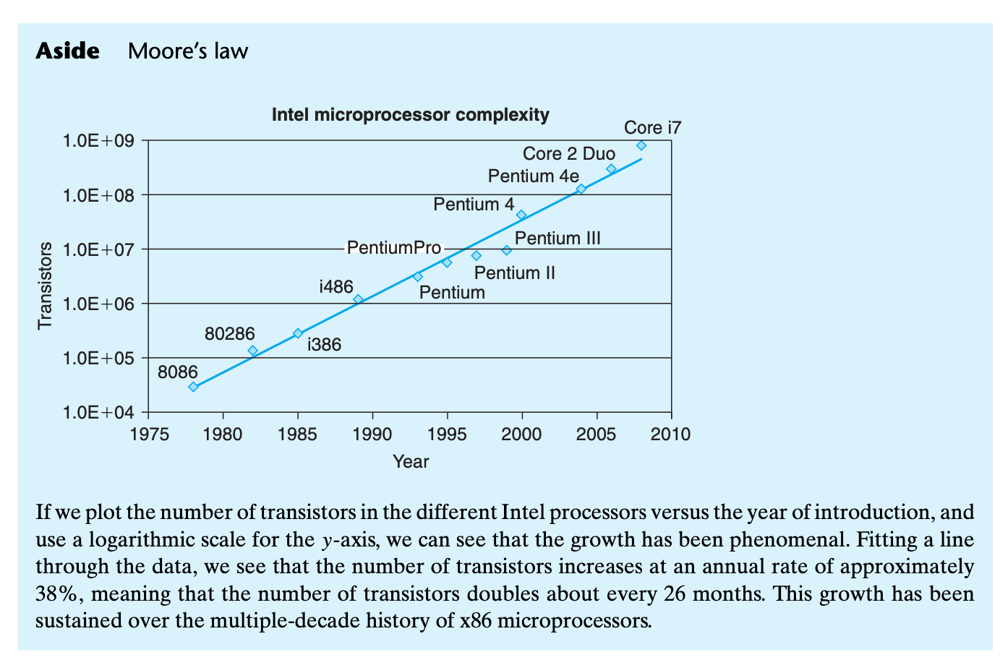
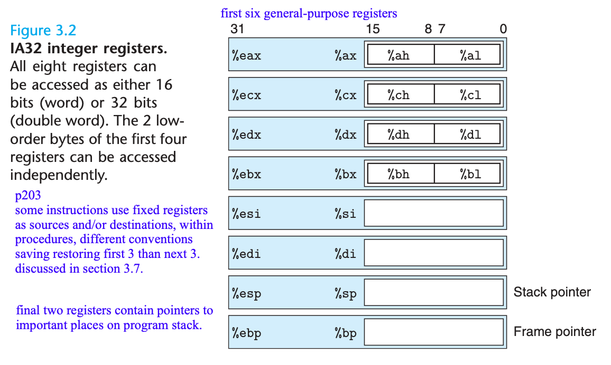

# Chapter 3 Machine-Level Representation of Programs

Assembly code is highly machine specific.

Relative to the computations expressed in the C code, optimizing compilers can

- rearrange execution order
- eliminate unneeded computations
- replace slow operations with faster ones
- even change recursive computations into iterative ones

The extension of IA32 to 64 bits, x86-64, was originally developed by Advanced Micro Devices (AMD).

- 32-bit machine can use around 4 Gb (2^32 bytes) random-access memory
- 64-bit machine can use up to 256 terabytes (2^48 bytes)

## 3.1 A Historical Perspective



Core i7: (2008, 781 M transistors). Incorporated both hyper-threading and multicore, with the initial version supporting two executing programs on each core and up to four cores on each chip.

Linux uses a memory model called flat addressing, where the entire memory space is viewed as a large array of bytes.

Over time, a number of formats and instructions have been added to x86 for manipulating vectors of small integers and floating-point numbers. They were added to improve performance on multimedia applications, such as image processing, audio and video encoding and decoding, and 3D graphics. GCC will make use of more recent extensions only when given specific command line options or when compiling for 64 bit operation.

## 3.2 Program Encodings

```bash
$gcc -O1 -o p p1.c p2.c
# note O1 not 01 level 1 optimization, in practice level 2 is better choice for performance
```

1. expand source code for `#include` and macros (`#define`)
1. gernerate assembly code versions p1.s and p2.s
1. the assembler converts the assembly code into binary object code p1.o and p2.o. object code is one form of machine code. It contains binary representations of all instructions, but the addresses of the global values are not filled in yet.
1. the linker merges object-code files along with library and generates the final executable file p. Executable code is the second form of machine code, the exact form executed by the processor.

### 3.2.1 Machine-Level Cdoe

Instruction set architecture (ISA): IA32 and x86-64.

1. ISA defines processor state, instruction format and effect on the state. Describe behavior as if instructions were executed in sequence. Processor hardware actually executes concurrently but employ safeguards to ensure behavior matches.
1. Memory addresses are virtual, providing a memory model appears to be a very large byte array.

Assembly code is close to machine code. Its main feature is a more readable textual format.

1. Program counter (PC) `%eip` in IA32 indicates the address in memory for the next instruction.
1. Integer register file contains 8 registers storing 32-bit values, which can hold pointers or integer data. Some registers are used to keep track of program state, others temporary data, such as local variables of a procedure, and function return value.
1. condition code registers for `if` and `while` statements
1. floating-point registers

Assembly code makes no distinctions between signed and unsigned integers, between different type of pointers, or even between pointers and integers.

A typical program will only have access to a few megabytes. The OS manages the virtual address space, translating virtual into actual processor memory.

### 3.2.2 Code Examples

See [code.c](../code/data/code.c).

```bash
gcc -O1 -S code1.c # generating aseembly file code.s
gcc -O1 -c code1.c # compile and assemble the code
```

Assembly code in book: all info about local variable names or data types were stripped away. Still see a reference to the global var `accum`, since the compiler has not determined where in memory this will be stored.

```asm
sum:
  pushl   %ebp
  movl    %esp, %ebp
  movl    12(%ebp), %eax
  addl    8(%ebp), %eax
  addl    %eax, accum
  popl    %ebp
  ret
```

```bash
$ gcc --version
Apple clang version 14.0.0 (clang-1400.0.29.202)
Target: x86_64-apple-darwin21.6.0
Thread model: posix
InstalledDir: /Library/Developer/CommandLineTools/usr/bin
```

code1.s on mac with above gcc version:

```asm
	.section	__TEXT,__text,regular,pure_instructions
	.build_version macos, 12, 0	sdk_version 13, 1
	.globl	_sum                            ## -- Begin function sum
	.p2align	4, 0x90
_sum:                                   ## @sum
	.cfi_startproc
## %bb.0:
	pushq	%rbp
	.cfi_def_cfa_offset 16
	.cfi_offset %rbp, -16
	movq	%rsp, %rbp
	.cfi_def_cfa_register %rbp
	movl	%edi, %eax
	addl	%esi, %eax
	addl	%eax, _accum(%rip)
	popq	%rbp
	retq
	.cfi_endproc
                                        ## -- End function
	.globl	_accum                          ## @accum
.zerofill __DATA,__common,_accum,4,2
.subsections_via_symbols
```

```
$ objdump -d code1.o

code1.o:        file format mach-o 64-bit x86-64

Disassembly of section __TEXT,__text:

0000000000000000 <_sum>:
       0: 55                            pushq   %rbp
       1: 48 89 e5                      movq    %rsp, %rbp
       4: 89 f8                         movl    %edi, %eax
       6: 01 f0                         addl    %esi, %eax
       8: 01 05 00 00 00 00             addl    %eax, (%rip)            ## 0xe <_sum+0xe>
       e: 5d                            popq    %rbp
       f: c3                            retq
```

- IA32 instructions is 1-15 bytes. Designed such that commonly used instructions and those with fewer operands require a smaller number of bytes than do less common ones or ones with more operands.
- from a given starting position, unique decoding of bytes into machine instructions. e.g., only `pushl %ebp` can start with byte value 55.
- disassembler determines assembly code purely based on the byte sequences in machine code, no need source code or assembly code
- disassembler sometimes omits the suffix `l`, e.g., in book, `mov` instead of `movl`. the suffixes are size designators

running a linker on the set of object-code files, one of which must contain a function `main`

```bash
$ gcc -O1 -o code1_exe.o code1.o code1_main.c
$ objdump -d code1_exe.o

code1_exe.o:    file format mach-o 64-bit x86-64

Disassembly of section __TEXT,__text:

0000000100003f90 <_sum>:
100003f90: 55                           pushq   %rbp
100003f91: 48 89 e5                     movq    %rsp, %rbp
100003f94: 89 f8                        movl    %edi, %eax
100003f96: 01 f0                        addl    %esi, %eax
100003f98: 01 05 62 00 00 00            addl    %eax, 98(%rip)          ## 0x100004000 <_accum>
100003f9e: 5d                           popq    %rbp
100003f9f: c3                           retq

0000000100003fa0 <_main>:
100003fa0: 55                           pushq   %rbp
100003fa1: 48 89 e5                     movq    %rsp, %rbp
100003fa4: bf 01 00 00 00               movl    $1, %edi
100003fa9: be 03 00 00 00               movl    $3, %esi
100003fae: e8 dd ff ff ff               callq   0x100003f90 <_sum>
100003fb3: 5d                           popq    %rbp
100003fb4: c3                           retq
```

almost identical to the disassembly of `code1.o`. the linker shifted location of code to a different range of addresses. linker has determined location to save the global variable `accum` (see second `addl` line). 

### 3.2.3 Notes on Formatting

```bash
$ gcc -O1 -S simple.c

# look at simple.s
    pushq	%rbp                    # save frame pointer
	.cfi_def_cfa_offset 16          # directives to guide assembler and linker
	.cfi_offset %rbp, -16
	movq	%rsp, %rbp              # create new frame pointer
	.cfi_def_cfa_register %rbp
	movl	%esi, %eax              # retrieve xp
	addl	(%rdi), %eax            # add xp to get t
	movl	%eax, (%rdi)            # store t at xp
	popq	%rbp                    # restore frame pointer
	retq                            # return
	
$ gcc -O1 -S -masm=intel simple.c
# intel format
    push	rbp
	.cfi_def_cfa_offset 16
	.cfi_offset rbp, -16
	mov	rbp, rsp
	.cfi_def_cfa_register rbp
	mov	eax, esi
	add	eax, dword ptr [rdi] # 16-bit word, 32-bit double words, 64-bit quad words
	mov	dword ptr [rdi], eax
	pop	rbp
	ret
```

## 3.3 Data Formats

GCC assembly suffix: `movb` move byte, `movw` move word, and `movl` move double word. Note suffix `l` is used for both 4-byte int and 9-byte double. This causes no ambiguity since floating point involves an entirely different set of instructions and registers.

## 3.4 Accessing Information



### 3.4.1 Operand Specifiers

### 3.4.1
