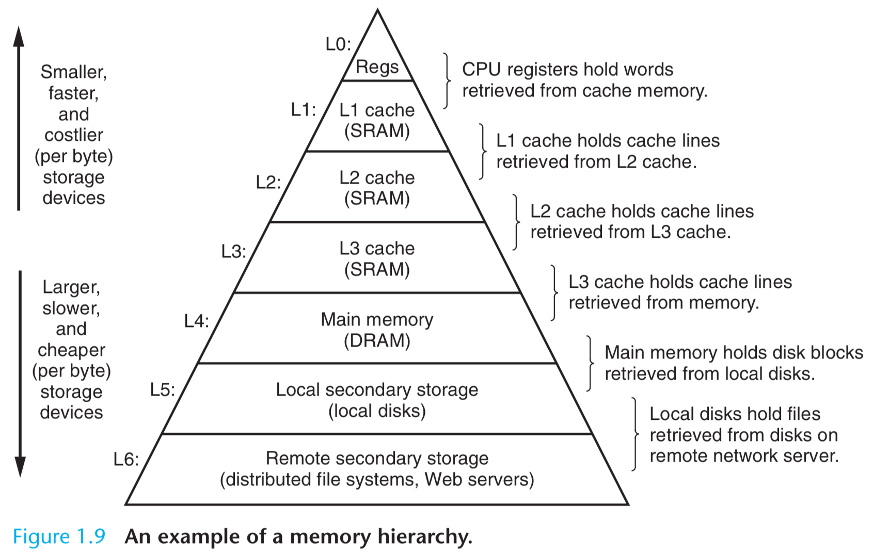

## Program Translation


```shell
unix> gcc -o hello hello.c
unix> ./hello
hello, world
unix>
```
The GNU environment includes the emacs editor, gcc compiler, gdb debugger, assembler, linker, utilities for manipulating binaries, and other components. The gcc compiler has grown to support many different languages, with the ability to generate code for many different machines. Supported languages include C, C++, Fortran, Java, Pascal, Objective-C, and Ada.

## Hardware Organization


**Buses**

Buses transfer fixed-sized chunks of bytes known as words. Most machines today have word sizes of either 4 bytes (32 bits) or 8 bytes (64 bits). We assume buses transfer one word at a time.

**I/O Devices**

Each IO device is connected to the IO bus by a controller or an adapter. The distinction between the two is mainly packaging. Controllers are chip sets in the device itself or on the system’s main printed circuit board (often called the motherboard). An adapter is a card that plugs into a slot on the motherboard. Regardless, the purpose of each is to transfer information back and forth between the I/O bus and an I/O device.

**Main Memory**

The main memory is a temporary storage device that holds both a program and the data it manipulates while the processor is executing the program. Physically, main memory consists of a collection of dynamic random access memory (DRAM) chips.

**Processor**

At its core is a word-sized storage device (or register) called the program counter (PC). At any point in time, the PC points at (contains the address of) some machine-language instruction in main memory. The processor reads the instruction from memory pointed at by the program counter (PC), interprets the bits in the instruction, performs some simple operation dictated by the instruction, and then updates the PC to point to the next instruction, which may or may not be contiguous in memory to the instruction that was just executed. There are only a few of these simple operations, and they revolve around main memory, the register file, and the arithmetic/logic unit (ALU). The register file is a small storage device that consists of a collection of word-sized registers, each with its own unique name. The ALU computes new data and address values.

We can distinguish the processor’s instruction set architecture, describing the effect of each machine-code instruction, from its microarchitecture, describing how the processor is actually implemented.

CPU 64 bit refers to the Program Counter (PC) size and also the bus transportation unit size, e.g., one word (64 or 32 bit) at a time is transferred. CPU includes PC, register file (RF, word size registers with unique names, a few hundred bytes, 100 times faster than memory), and ALU arithmetic/logic unit, L1 cache (10,1000s bytes, speed close to RF).

L2 cache connects through special bus, millions of bytes, 5 times slower than L1, 5-10 times faster than memory. L1 and L2 static random access memory (SRAM).

Machine Language: IA 32, x86-64.

## Running Executable

Using a technique known as direct memory access (DMA), the data travels directly from disk to main memory, without passing through the processor.


Once the code and data in the hello object file are loaded into memory, the processor begins executing the machine-language instructions in the hello program’s main routine. These instructions copy the bytes in the “hello, world\n” string from memory to the register file, and from there to the display device, where they are displayed on the screen.


## Cache

For example, the disk drive on a typical system might be 1000 times larger than the main memory, but it might take the processor 10,000,000 times longer to read a word from disk than from memory.  Even more troublesome, as semiconductor technology progresses over the years, this processor-memory gap continues to increase. It is easier and cheaper to make processors run faster than it is to make main memory run faster.

The L1 and L2 caches are implemented with a hardware technology known as static random access memory (SRAM). Newer and more powerful systems even have three levels of cache: L1, L2, and L3. The idea behind caching is that a system can get the effect of both a very large memory and a very fast one by exploiting locality, the tendency for programs to access data and code in localized regions.

||Size|Speed/Time Needed|
|-|-|-|
|Register|100 bytes|1|
|L1 Cache|10k bytes|1.1|
|L2 Cache|100k-1b bytes|5-10|
|RAM|1 Gb|100|
|Disk|1 Tb|1 billion|


