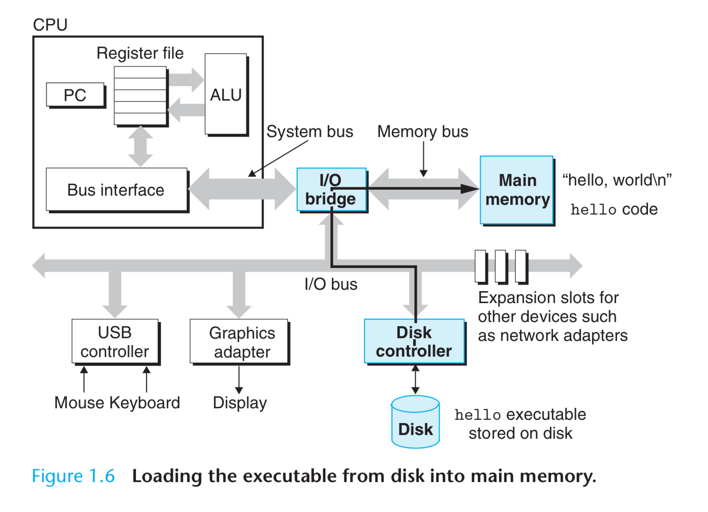
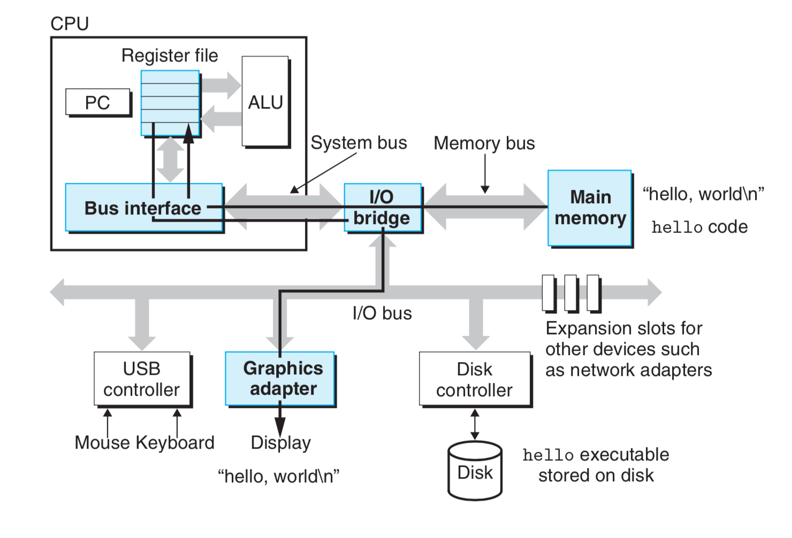
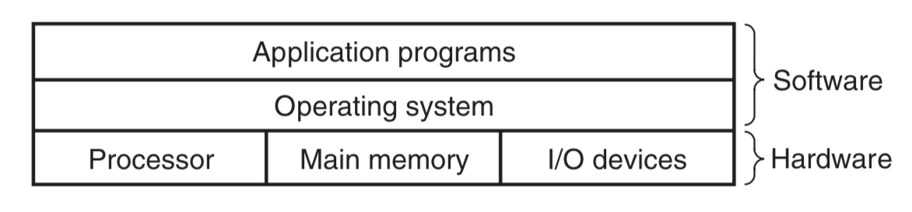
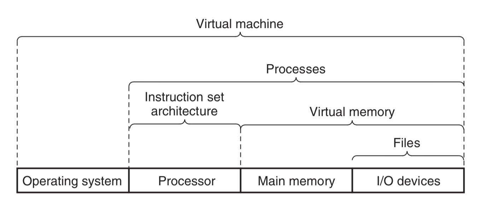
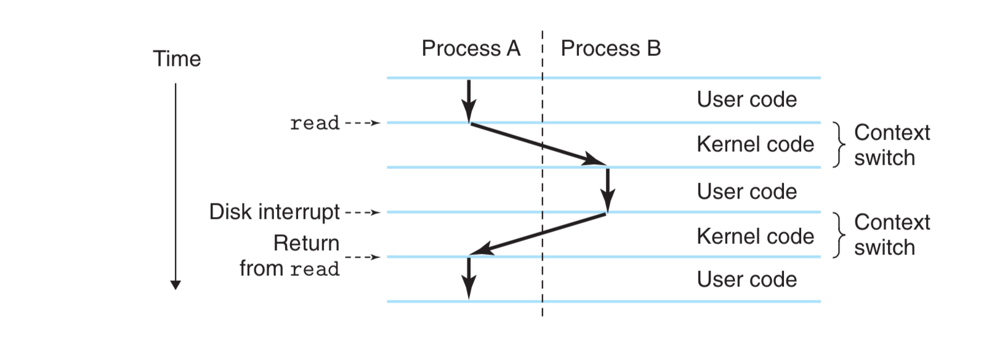
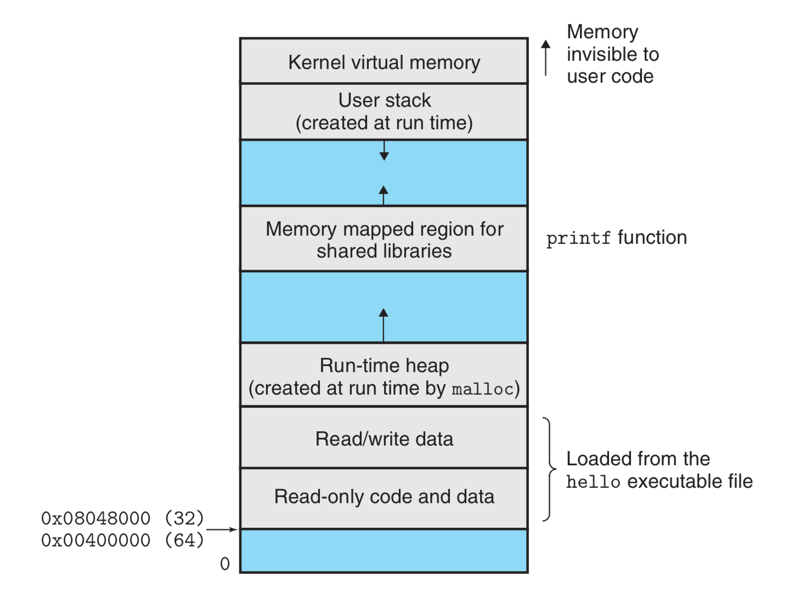
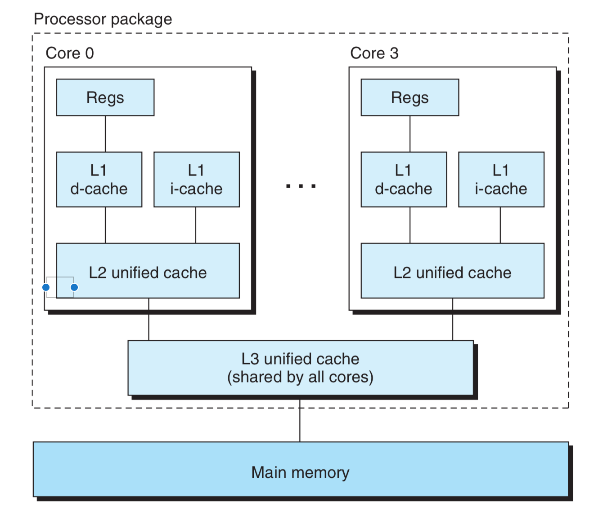

## Program Translation


```shell
unix> gcc -o hello hello.c
unix> ./hello
hello, world
unix>
```
The GNU environment includes the emacs editor, gcc compiler, gdb debugger, assembler, linker, utilities for manipulating binaries, and other components. The gcc compiler has grown to support many different languages, with the ability to generate code for many different machines. Supported languages include C, C++, Fortran, Java, Pascal, Objective-C, and Ada.

## Hardware Organization


**Buses**

Buses transfer fixed-sized chunks of bytes known as words. Most machines today have word sizes of either 4 bytes (32 bits) or 8 bytes (64 bits). We assume buses transfer one word at a time.

**I/O Devices**

Each IO device is connected to the IO bus by a controller or an adapter. The distinction between the two is mainly packaging. Controllers are chip sets in the device itself or on the system’s main printed circuit board (often called the motherboard). An adapter is a card that plugs into a slot on the motherboard. Regardless, the purpose of each is to transfer information back and forth between the I/O bus and an I/O device.

**Main Memory**

The main memory is a temporary storage device that holds both a program and the data it manipulates while the processor is executing the program. Physically, main memory consists of a collection of dynamic random access memory (DRAM) chips.

**Processor**

At its core is a word-sized storage device (or register) called the program counter (PC). At any point in time, the PC points at (contains the address of) some machine-language instruction in main memory. The processor reads the instruction from memory pointed at by the program counter (PC), interprets the bits in the instruction, performs some simple operation dictated by the instruction, and then updates the PC to point to the next instruction, which may or may not be contiguous in memory to the instruction that was just executed. There are only a few of these simple operations, and they revolve around main memory, the register file, and the arithmetic/logic unit (ALU). The register file is a small storage device that consists of a collection of word-sized registers, each with its own unique name. The ALU computes new data and address values.

We can distinguish the processor’s instruction set architecture, describing the effect of each machine-code instruction, from its microarchitecture, describing how the processor is actually implemented.

CPU 64 bit refers to the Program Counter (PC) size and also the bus transportation unit size, e.g., one word (64 or 32 bit) at a time is transferred. CPU includes PC, register file (RF, word size registers with unique names, a few hundred bytes, 100 times faster than memory), and ALU arithmetic/logic unit, L1 cache (10,1000s bytes, speed close to RF).

L2 cache connects through special bus, millions of bytes, 5 times slower than L1, 5-10 times faster than memory. L1 and L2 static random access memory (SRAM).

Machine Language: IA 32, x86-64.

## Running Executable

Using a technique known as direct memory access (DMA), the data travels directly from disk to main memory, without passing through the processor.



Once the code and data in the hello object file are loaded into memory, the processor begins executing the machine-language instructions in the hello program’s main routine. These instructions copy the bytes in the “hello, world\n” string from memory to the register file, and from there to the display device, where they are displayed on the screen.



## Cache

For example, the disk drive on a typical system might be 1000 times larger than the main memory, but it might take the processor 10,000,000 times longer to read a word from disk than from memory.  Even more troublesome, as semiconductor technology progresses over the years, this processor-memory gap continues to increase. It is easier and cheaper to make processors run faster than it is to make main memory run faster.

The L1 and L2 caches are implemented with a hardware technology known as static random access memory (SRAM). Newer and more powerful systems even have three levels of cache: L1, L2, and L3. The idea behind caching is that a system can get the effect of both a very large memory and a very fast one by exploiting locality, the tendency for programs to access data and code in localized regions.

||Size|Speed/Time Needed|
|-|-|-|
|Register|100 bytes|1|
|L1 Cache|10k bytes|1.1|
|L2 Cache|100k-1b bytes|5-10|
|RAM|1 Gb|100|
|Disk|1 Tb|1 billion|


## OS Manages Hardware

All attempts by an application program to manipulate the hardware must go through the operating system.



The use of abstractions is one of the most important concepts in computer science. For example, one aspect of good programming practice is to formulate a simple application-program interface (API) for a set of functions that allow programmers to use the code without having to delve into its inner workings. Different programming languages provide different forms and levels of support for abstraction, such as Java class declarations and C function prototypes.

On the processor side, the instruction set architecture provides an abstraction of the actual processor hardware. With this abstraction, a machine-code program behaves as if it were executed on a processor that performs just one instruction at a time. The underlying hardware is far more elaborate, executing multiple instructions in parallel, but always in a way that is consistent with the simple, sequential model. By keeping the same execution model, different processor implementations can execute the same machine code, while offering a range of cost and performance.



### Processes



### Threads

Threads are an increasingly important programming model because of the requirement for concurrency in network servers, because it is easier to share data between multiple threads than between multiple processes, and because threads are typically more efficient than processes.

### Virtual Memory

Each process has the same uniform view of memory, which is known as its virtual address space.



The virtual address space seen by each process consists of a number of well- defined areas, each with a specific purpose.

- Program code and data.
- Heap. Dynamically change by `malloc` and `free`.
- Shared libraries. C standard and math library.
- Stack. Dynamically change with function calls.
- Kernel virtual memory.

For virtual memory to work, a sophisticated interaction is required between the hardware and the operating system software, including a hardware translation of every address generated by the processor. The basic idea is to store the contents of a process’s virtual memory on disk, and then use the main memory as a cache for the disk.

### Files

Every I/O device, including disks, keyboards, displays, and even networks, is modeled as a file.

## Important Themes

### Concurrency and Parallelism



**Thread Level Concurrency**

Hyperthreading, sometimes called simultaneous multi-threading, is a technique that allows a single CPU to execute multiple flows of control. It involves having multiple copies of some of the CPU hardware, such as program counters and register files, while having only single copies of other parts of the hardware, such as the units that perform floating-point arithmetic. Whereas a conventional processor requires around **20,000** clock cycles to shift between different threads, a hyperthreaded processor decides which of its threads to execute on a cycle-by-cycle basis. It enables the CPU to make better advantage of its processing resources. For example, if one thread must wait for some data to be loaded into a cache, the CPU can proceed with the execution of a different thread. As an example, the Intel Core i7 processor can have each core executing two threads, and so a four-core system can actually execute eight threads in parallel.

**Instruction Level Parallelism**

The 1978-vintage Intel 8086 required multiple (typically, 3–10) clock cycles to execute a single instruction. More recent processors can sustain execution rates of 2–4 instructions per clock cycle. Any given instruction requires much longer from start to finish, perhaps 20 cycles or more, but the processor uses a number of clever tricks to process as many as 100 instructions at a time.

Pipelining, where the actions required to execute an instruction are partitioned into different steps and the processor hardware is organized as a series of stages, each performing one of these steps. The stages can operate in parallel, working on different parts of different instructions. We will see that a fairly simple hardware design can sustain an execution rate close to one instruction per clock cycle.

Processors that can sustain execution rates faster than one instruction per cycle are known as superscalar processors. Most modern processors support superscalar operation. In Chapter 5, we will describe a high-level model of such processors. We will see that application programmers can use this model to understand the performance of their programs. They can then write programs such that the generated code achieves higher degrees of instruction-level parallelism and therefore runs faster.

**Single-Instruction, Multiple-Data (SIMD) Parallelism**

Recent generations of Intel and AMD processors have instructions that can add four pairs of single-precision floating-point numbers (C data type float) in parallel.

These SIMD instructions are provided mostly to speed up applications that process image, sound, and video data. Although some compilers attempt to automatically extract SIMD parallelism from C programs, a more reliable method is to write programs using special vector data types supported in compilers such as gcc.