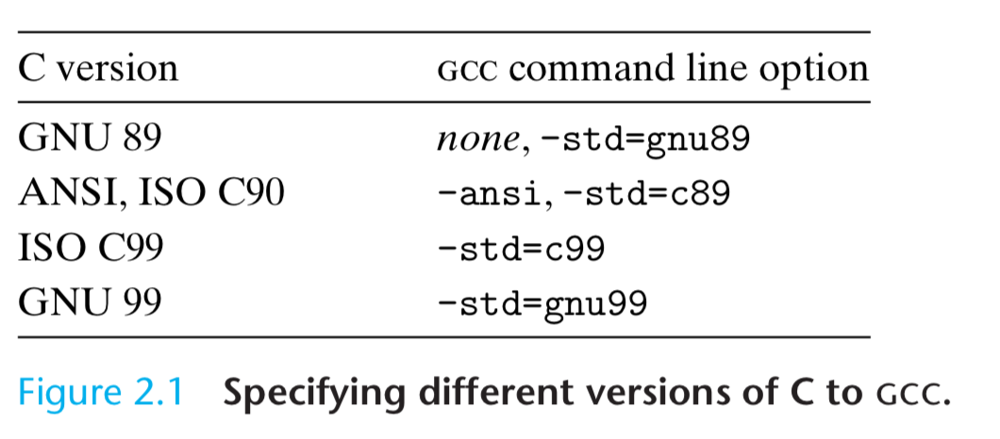
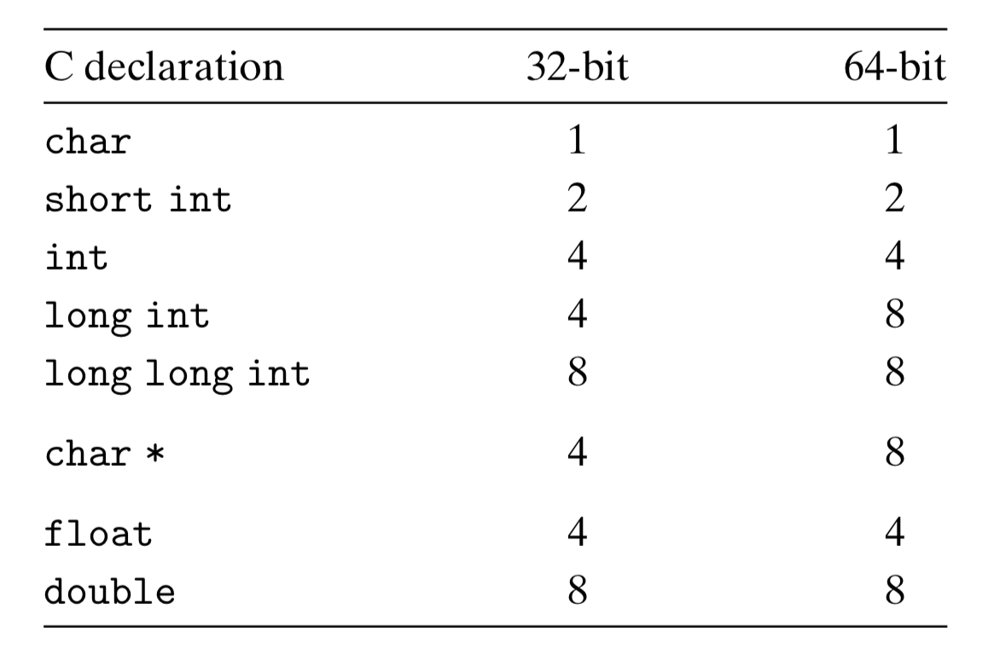
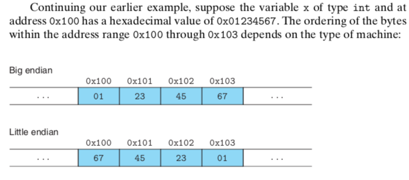
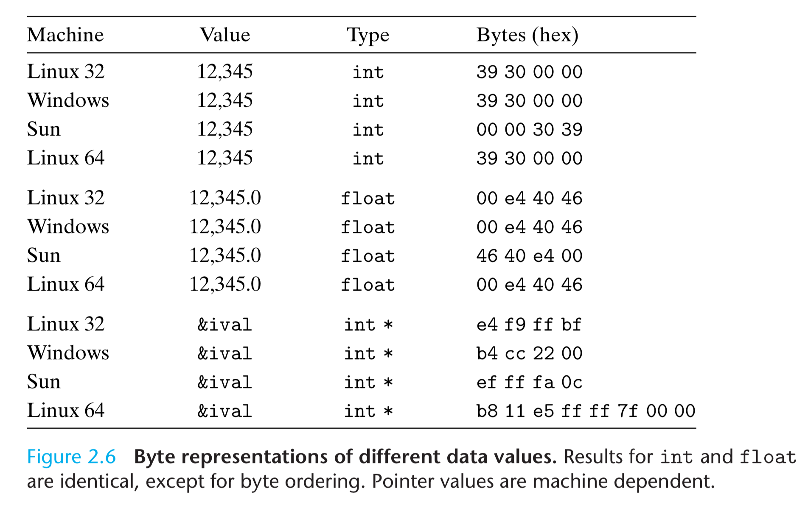
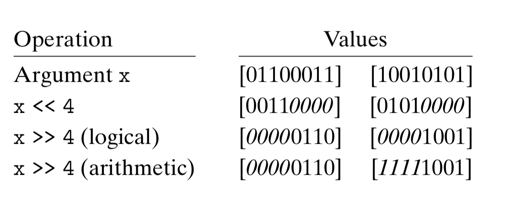
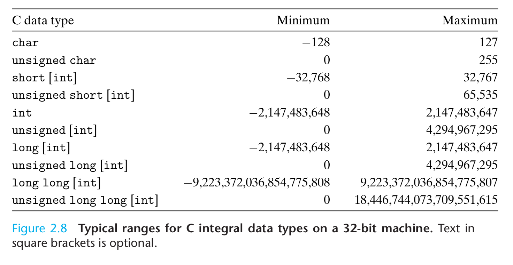
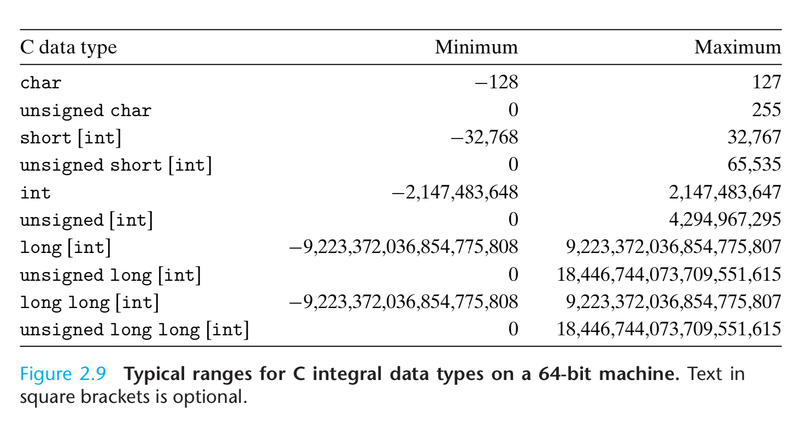
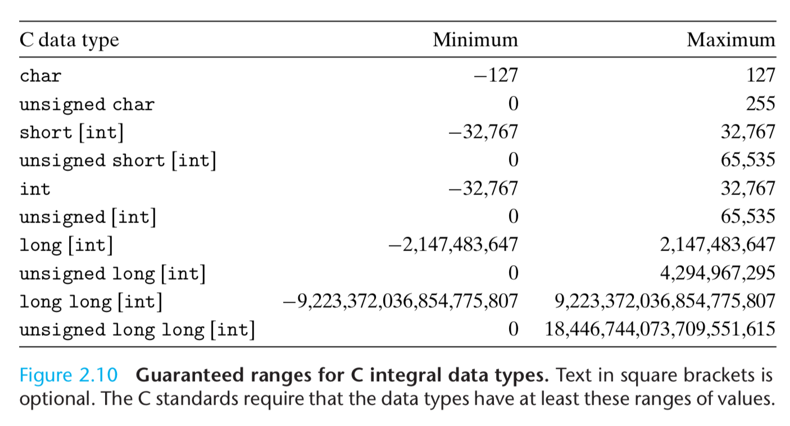
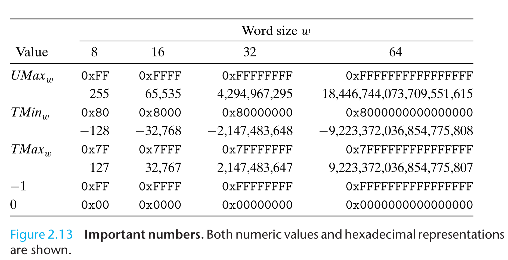
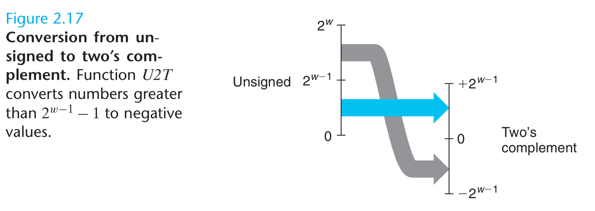

# Representing and Manipulating Information

Using decimal notation is natural for ten-fingered humans, but binary values work better when building machines that store and process information. Two-valued signals can readily be represented, stored, and transmitted, for example, as the presence or absence of a hole in a punched card, as a high or low voltage on a wire, or as a magnetic domain oriented clockwise or counterclockwise.

Integer encoding can be unsigned or two's-complement. Some operations can overflow. On 32 bit system, `200 * 300 * 400 * 500` yields `−884,901,888`. Integer computer arithmetic satisfies many of the familiar properties of true integer arithmetic. For example, multiplication is associative and commutative.

Floating-point encodings are a base-two version of scientific notation for representing real numbers. The product of a set of positive numbers will always be positive, although over- flow will yield the special value +∞. Floating-point arithmetic is not associative, due to the finite precision of the representation. For example, the C expression (3.14+1e20)-1e20 will evaluate to 0.0 on most machines, while 3.14+(1e20- 1e20) will evaluate to 3.14.

Integer representations can encode a comparatively small range of values, but do so precisely, while floating-point representations can encode a wide range of values, but only approximately.



```shell
$ gcc --version
Configured with: --prefix=/Applications/Xcode.app/Contents/Developer/usr --with-gxx-include-dir=/Applications/Xcode.app/Contents/Developer/Platforms/MacOSX.platform/Developer/SDKs/MacOSX.sdk/usr/include/c++/4.2.1
Apple clang version 11.0.0 (clang-1100.0.33.12)
Target: x86_64-apple-darwin18.7.0
Thread model: posix
InstalledDir: /Applications/Xcode.app/Contents/Developer/Toolchains/XcodeDefault.xctoolchain/usr/bin
$ bash TestCVersion.sh
c89
__STRICT_ANSI__

c99
__STDC_VERSION__ = 199901
__STRICT_ANSI__

c11
__STDC_VERSION__ = 201112
__STRICT_ANSI__

c17
__STDC_VERSION__ = 201710
__STRICT_ANSI__

gnu89

gnu99
__STDC_VERSION__ = 199901

gnu11
__STDC_VERSION__ = 201112

gnu17
__STDC_VERSION__ = 201710

default
__STDC_VERSION__ = 201112
```

## Information Storage

Most computers use blocks of eight bits, or bytes, as the smallest addressable unit of memory. Every byte of memory is identified by a unique number, known as its address, and the set of all possible addresses is known as the virtual address space. As indicated by its name, this virtual address space is just a conceptual image presented to the machine-level program. The actual implementation uses a combination of random-access memory (RAM), disk storage, special hardware, and operating system software to provide the program with what appears to be a monolithic byte array.

The value of a pointer in C—whether it points to an integer, a structure, or some other program object—is the virtual address of the first byte of some block of storage. The C compiler also associates type information with each pointer, so that it can generate different machine-level code to access the value stored at the location designated by the pointer depending on the type of that value. Although the C compiler maintains this type information, the actual machine-level program it generates has no information about data types. It simply treats each program object as a block of bytes, and the program itself as a sequence of bytes.

### Hexadecimal Notation

For $x=2^n$, we write $n=i+4j$, where $0 \leq i \leq 3$, we write a leading hex digit of $1 (i = 0), 2 (i= 1), 4 (i=2), 8 (i=3)$, followed by $j$ hexadecimal $0$s. For example, for $x=2048=2^11$, $n=11=3 + 4\cdot2$, hex representaton is $800$.

### Words

For a machine with a w-bit word size, the virtual addresses can range from $0$ to $2^w − 1$, giving the program access to at most $2^w$ bytes.

|word size|memory size|actual number|
|-|-|-|
|32 bit|4 Giga bytes|4,294,967,296|
|64 bit|18 Exa bytes|18,446,744,073,709,551,616|

### Data Sizes



### Addressing and Byte Odering

In virtually all machines, a multi-byte object is stored as a contiguous sequence of bytes, with the address of the object given by the smallest address of the bytes used. For example, suppose a variable x of type int has address 0x100, that is, the value of the address expression &x is 0x100. Then the 4 bytes of x would be stored in memory locations 0x100, 0x101, 0x102, and 0x103.

The former convention—where the least significant byte comes first—is referred to as **little endian**. This convention is followed by most Intel-compatible machines. The latter convention—where the most significant byte comes first—is referred to as **big endian**. This convention is followed by most machines from IBM and Sun Microsystems. Note that we said “most”. The conventions do not split precisely along corporate boundaries. For example, both IBM and Sun manufacture machines that use Intel-compatible processors and hence are little endian. Many recent microprocessors are bi-endian, meaning that they can be configured to operate as either little- or big-endian machines.



A common problem is for data produced by a little-endian machine to be sent to a big-endian machine, or vice versa, leading to the bytes within the words being in reverse order for the receiving program. To avoid such problems, code written for networking applications must follow established conventions for byte ordering to make sure the sending machine converts its internal representation to the network standard, while the receiving machine converts the network standard to its internal representation.



```bash
$ show-bytes.o
calling show_twocomp
 39 30
 c7 cf
Calling simple_show_a
 21
 21 43
 21 43 65
Calling simple_show_b
 78
 78 56
 78 56 34
Calling float_eg
# 21 bits match, from . to .
For x = 3490593
 21 43 35 00 # 0000 0000 001.1 0101 0100 0011 0010 0001.
 84 0c 55 4a #   0100 1010 0.101 0101 0000 1100 1000 01.00
For x = 3510593
 41 91 35 00
 04 45 56 4a
Calling string_ueg
 41 42 43 44 45 46
Calling string_leg
 61 62 63 64 65 66
 31 32 33 34 35 00
$ show-bytes.o 1
calling test_show_bytes
 01 00 00 00 # show int
 00 00 80 3f # show float
 98 d7 20 ef fe 7f 00 00 # show pointer
```

### 2.1.5 Representing Strings

### 2.1.6 Representign Code

```C
int sum(int x, int y) {
    return x + y;
}
```

|Machine|Compiled Code|
|-|-|
|Linux 32|55 89 e5 8b 45 0c 03 45 08 c9 c3|
|Windows|55 89 e5 8b 45 0c 03 45 08 5d c3|
|Sun|81 c3 e0 08 90 02 00 09|
|Linux 64|55 48 89 e5 89 7d fc 89 75 f8 03 45 fc c9 c3|

Different machine types use different and incompatible instructions and encodings. Even identical processors running different operating systems have differences in their coding conventions and hence are not binary compatible. Binary code is seldom portable across different combinations of machine and operating system.

### 2.1.7 Boolean Algebra

One useful application of bit vectors is to represent finite sets. We can encode any subset $A⊆\{0,1,...,w−1\}$ with a bit vector $[a_{w−1},...,a_1,a_0]$,where $a_i = 1$ if and only if $i ∈ A$. For example, recalling that we write $a_{w−1}$ on the left and $a_0$ on the right,bit vector `a = [01101001]` encodes the set `A = {0, 3, 5, 6}`, while bit vector `b = [01010101]` encodes the set `B = {0, 2, 4, 6}`. With this way of encoding sets, Boolean operations `|` and `&` correspond to set union and intersection, respectively, and `~` corresponds to set complement. Continuing our earlier example, the operation `a & b` yields bit vector `[01000001]`, while `A ∩ B` = `{0, 6}`.

### 2.1.8 Bit-Level Operation in C

One common use of bit-level operations is to implement masking operations. For example, with `x = 0x89ABCDEF`, `x & 0xFF` would yield `0x000000EF`. The expression ~0 will yield a mask of all ones, regardless of the word size of the machine. Although the same mask can be written `0xFFFFFFFF` for a 32-bit machine, such code is not as portable.

Practice Problem 2.12

Write C expressions, in terms of variable x, for the following values. Your code should work for any word size w ≥ 8. For reference, we show the result of evaluating the expressions for `x = 0x87654321`, with w = 32.

A. The least significant byte of x, with all other bits set to 0. [0x00000021].

Answer: `x & 0xFF`

B. All but the least significant byte of x complemented, with the least significant byte left unchanged. [0x789ABC21].

Answer: `x ^ ~ 0xFF`, me `~ x & 0xFF`

C. The least significant byte set to all 1s, and all other bytes of x left unchanged. [0x876543FF].

Answer: `x | 0xFF`

### 2.1.9 Logical Operation in C

A second important distinction between the logical operators `&&` and `||` versus their bit-level counterparts `&` and `|` is that the logical operators do not evaluate their second argument if the result of the expression can be determined by evaluating the first argument. Thus, for example, the expression `a && 5/a` will never cause a division by zero, and the expression `p && *p++` will never cause the dereferencing of a null pointer.

Practice Problem 2.15

Using only bit-level and logical operations, write a C expression that is equivalent to `x == y`. In other words, it will return 1 when x and y are equal, and 0 otherwise.

Answer: `!(x^y)`, `~(x^y)` incorrect, e.g., `~1` is not `0` but `0xFFFFFFFE` for 32 bit int.

### 2.1.10 Shift Operation in C

**Shift left**

For $x : [x_n−1, x_n−2, . . . , x_0]$, $x << k : [x_{n−k−1}, x_{n−k−2},...,x_0,0,...,0]$. That is, x is shifted k bits to the left, dropping off the k most significant bits and filling the right end with k zeros.

**Logical right shift**

Result is $[0, . . . , 0, x_{n−1}, x_{n−2}, ..., x_k]$

**Arithmetic right shift**

Result is $[x_{n−1}, . . . , x_{n−1}, x_{n−1}, x_{n−2}, ..., x_k]$

The C standards do not precisely define which type of right shift should be used. For unsigned data (i.e., integral objects declared with the qualifier unsigned), right shifts must be logical. For signed data (the default), either arithmetic or logical shifts may be used. This unfortunately means that any code assuming one form or the other will potentially encounter portability problems. In practice, however, almost all compiler/machine combinations use arithmetic right shifts for signed data, and many programmers assume this to be the case.

Java, on the other hand, has a precise definition of how right shifts should be performed. The expression `x >> k` shifts x arithmetically by k positions, while `x >>> k` shifts it logically.



For a data type consisting of w bits, what should be the effect of shifting by some value k ≥ w? See `shiftGreaterThanWordSize()` in `bits.c`. The C standards carefully avoid stating what should be done in such a case. On many machines, the shift instructions consider only the lower log2 w bits of the shift amount when shifting a w-bit value, and so the shift amount is effectively computed as k mod w.

This behavior is not guaranteed for C programs, however, and so shift amounts should be kept less than the word size.
Java, on the other hand, specifically requires that shift amounts should be computed in the modular fashion we have shown.

## Character Encodings

- An ASCII character in 8-bit ASCII encoding is 8 bits (1 byte), though it can fit in 7 bits.
- An ISO-8895-1 (extended ASCII) character in ISO-8859-1 encoding is 8 bits (1 byte).
- A Unicode character in UTF-8 encoding is between 8 bits (1 byte) and 32 bits (4 bytes).
- A Unicode character in UTF-16 encoding is between 16 (2 bytes) and 32 bits (4 bytes), though most of the common characters take 16 bits. This is the encoding used by Windows internally (windows cp1252 uses 1 byte ).
- A Unicode character in UTF-32 encoding is always 32 bits (4 bytes).
- An ASCII character in UTF-8 is 8 bits (1 byte), and in UTF-16 - 16 bits. The additional (non-ASCII) characters in ISO-8895-1 (0xA0-0xFF) would take 16 bits in UTF-8 and UTF-16.
- That would mean that there are between 0.03125 and 0.125 characters in a bit.

The Java programming language uses Unicode in its representations of strings. Program libraries are also available for C to support Unicode.

## 2.2 Integer Representations





### 2.2.1 Integral Data Types



Both C and C++ support signed (the default) and unsigned numbers. Java supports only signed numbers.

### 2.2.2 Unsigned Encoding

We write bit vector as $\vec x$, or $[x_{w−1}, x_{w−2}, ... , x_0]$ for an integer data type of $w$ bits. The value can be calculated as below. $B2U_w$ means binary to unsigned w bits. This mapping is a bijection—it associates a unique value to each bit vector of length w; conversely, each integer between $0$ and $2^w − 1$ has a unique binary representation as a bit vector of length w.

$B2U_w(\vec x) \doteq \sum_{i=0}^{w-1}x_i2^i$

In this equation, the notation $\doteq$ means that the left-hand side is defined to be equal to the right-hand side.

### 2.2.3 Two's Complement Encoding

The most common computer representation of signed numbers is known as two’s-complement form. This is defined by interpreting the most significant bit of the word to have negative weight. We express this interpretation as a function $B2T_w$ (for “binary to two’s-complement” length w):

$B2T_w(\vec x) \doteq -x_{w-1} \cdot 2^{w-1} + \sum_{i=0}^{w-1}x_i2^i$

We say that the function B2Tw is a bijection—it associates a unique value to each bit vector of length w; conversely, each integer between $− 2^{w−1}$ and $2^{w−1} − 1$ has a unique binary representation as a bit vector of length w.



Note that −1 has the same bit representation as $UMax$—a string of all ones. Numeric value 0 is represented as a string of all zeros in both representations.

For some programs, it is essential that data types be encoded using representations with specific sizes. For example, when writing programs to enable a machine to communicate over the Internet according to a standard protocol, it is important to have data types compatible with those specified by the protocol.

The Java standard is quite specific about integer data type ranges and representations. It requires a two’s-complement representation with the exact ranges shown for the 64-bit case. In Java, the single-byte data type is called `byte` instead of `char`, and there is no `long long` data type. These detailed requirements are intended to enable Java programs to behave identically regardless of the machines running them.

Ones' complement: the most significant bit has weight $−(2^{w−1} − 1)$ rather than $− 2^{w−1}$.

$B2O_w(\vec x) \doteq -x_{w-1} \cdot (2^{w-1} - 1) + \sum_{i=0}^{w-1}x_i2^i$

Sign magnitude: the most significant bit is a sign bit that determines whether the remaining bits should be given negative or positive weight.

$B2S_w(\vec x) \doteq (-1)^{x_{w-1}} \cdot \sum_{i=0}^{w-2}x_i2^i$

Note the different position of apostrophes: Two’s complement versus Ones’ complement. The term “two’s complement” arises from the fact that for nonnegative x we compute a w-bit representation of $−x$ as $2^w − x$ (a single two). The term “ones’ complement” comes from the property that we can compute $−x$ in this notation as $[111...1] − x$ (multiple ones).

### 2.2.4 Conversions Between Signed and Unsigned



### 2.2.5 Signed vs. Unsigned in C

In `limits.h` C header file,

```C
#define INT_MIN   (-INT_MAX - 1)
```


Unfortunately, a curious interaction between the asymmetry of the two’s-complement representation and the conversion rules of C force us to write $TMin32$ in this unusual way.

### 2.2.6 Expanding the Bit Representation

To convert an unsigned number to a larger data type, we can simply add leading zeros to the representation; this operation is known as zero extension. For converting a two’s- complement number to a larger data type, the rule is to perform a sign extension, adding copies of the most significant bit to the representation.

```C
short sx = -12345; /* -12345 */
unsigned uy = sx; /* Mystery! */
```

When converting from short to unsigned, we first change the size and then from signed to unsigned. That is, (unsigned) sx is equivalent to (unsigned) (int) sx, evaluating to 4,294,954,951, not (unsigned) (unsigned short) sx, which evaluates to 53,191.
