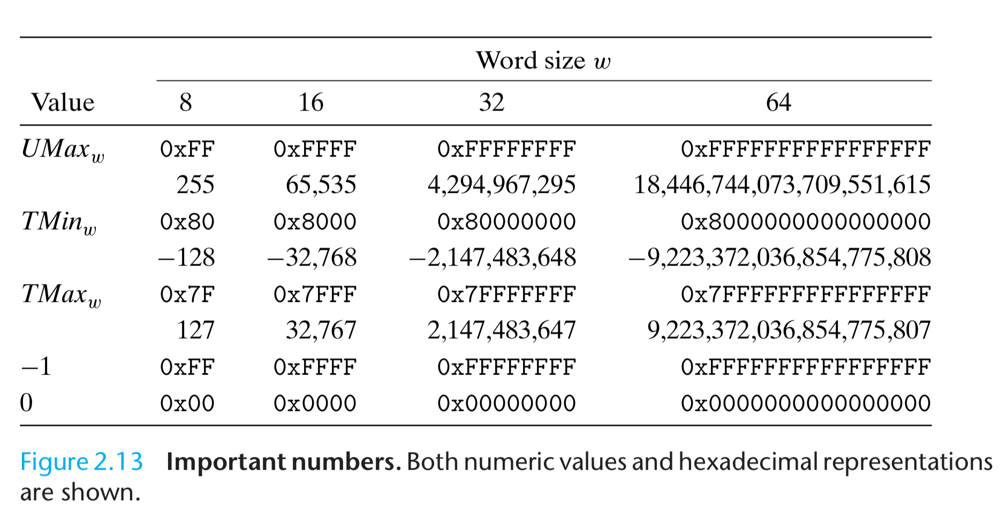

# GetAways
## Timing

For example, a 4GHz processor performs 4,000,000,000 clock cycles per second.

Operations|Clock Cycles
-|-
shift between threads|20,000
int multiplication|10
int division|30
int addition, subtraction, bit-level|1

## int range

see chapter 2, figure 2.13.



## Assembly

```asm
%eip # indicates the address in memory for the next instruction
pushl   %ebp # push register ebp content to stack
```

## heap and stack

https://stackoverflow.com/questions/3707517/make-file-echo-displaying-path-string

```bash
$ ./stack_heap.o # stack above heap, stack growing down, heap growing up
depth 10, stack at 0x7ff7b759a60b, heap at 0x7f92a87059e0
depth  9, stack at 0x7ff7b759a5eb, heap at 0x7f92a87059f0
depth  8, stack at 0x7ff7b759a5cb, heap at 0x7f92a8705a00
depth  7, stack at 0x7ff7b759a5ab, heap at 0x7f92a8705a10
depth  6, stack at 0x7ff7b759a58b, heap at 0x7f92a8705a20
depth  5, stack at 0x7ff7b759a56b, heap at 0x7f92a8705a30
depth  4, stack at 0x7ff7b759a54b, heap at 0x7f92a8705a40
depth  3, stack at 0x7ff7b759a52b, heap at 0x7f92a8705a50
depth  2, stack at 0x7ff7b759a50b, heap at 0x7f92a8705a60
depth  1, stack at 0x7ff7b759a4eb, heap at 0x7f92a8705a70
depth  0, stack at 0x7ff7b759a4cb, heap at 0x7f92a8705a80
$ ulimit -s
8192
```

## double pointer linked list

- https://stackoverflow.com/questions/12914917/using-pointers-to-remove-item-from-singly-linked-list
- https://leetcode.com/problems/remove-nth-node-from-end-of-list/discuss/8812/My-short-C++-solution/498613

See [c_file](./c/double_pointer.c).

The idea is similar to add a dummy node. In Java, `dummy` is a whole new `Node`, in c/c++, `pp` is just another pointer points to a pointer of type `Node**`.

```java
Node dummy = new Node();
dummy.next = head;

// to move along
dummy = dummy.next;

// delete dummy.next, dummy.next must be non-null
dummy.next = dummy.next.next;
// typically dummy is kept to point to the Node before head
// can be used as cur to move along and stop before the non-null node to be deleted
```
equivalent to 
```c
int **pp = &head; // head type is node*, pp is node**
// pp is a pointer to head, *pp is head, *head and **pp is the first node

// to move along, assigning new value to double pointer node**
pp = &((*pp)->next); // or pp = &((**pp).next)
// (*pp)->next and (**pp).next type is node*

// *pp must be non-null
*pp = (*pp)->next; // equivalent to dummy.next = dummy.next.next;
*pp = (**pp).next; // this might be easier to understand
// change where (*pp) is pointing, but pp is still pointing at the same
```
