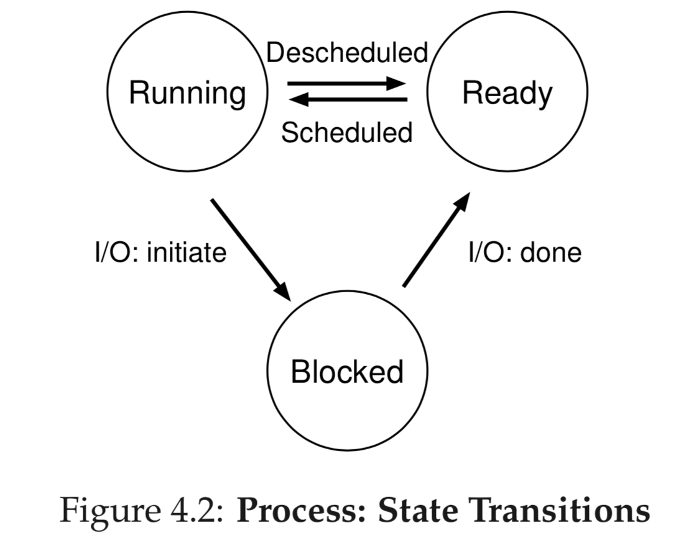

# Process

One of the most fundamental abstractions of OS is process. The definition of a process, informally, is quite simple: it is a running program. A typical system may be seemingly running tens or even hundreds of processes at the same time and provides the illusion of a nearly-endless supply of said CPUs.

To implement virtualization of the CPU, and to implement it well, the OS will need both some low-level machinery as well as some high-level intelligence. We call the low-level machinery mechanisms; mechanisms are low-level methods or protocols that implement a needed piece of functionality. For example, we’ll learn later how to implement a context switch, which gives the OS the ability to stop running one program and start running another on a given CPU; this time-sharing mechanism is employed by all modern OSes.

On top of these mechanisms resides some of the intelligence in the OS, in the form of policies. Policies are algorithms for making some kind of decision within the OS. For example, given a number of possible programs to run on a CPU, which program should the OS run? A scheduling policy in the OS will make this decision, likely using historical information (e.g., which program has run more over the last minute?), workload knowledge (e.g., what types of programs are run), and performance metrics (e.g., is the system optimizing for interactive performance, or throughput?) to make its decision.

## The Abstraction-Process

The process’s machine state
- the memory that the process can address (called its address space)
- registers
-  program counter (PC) (sometimes called the instruction pointer or IP) tells us which instruction is currently being executed, a stack pointer and associated frame pointer are used to manage the stack for function parameters, local variables, and return addresses.
- Persistent storage devices. Such I/O information might include a list of the files the process currently has open.

## Process API

- Create: any command
- Destroy: `kill`
- Wait: listener on a process to wait for stop signal
- Miscellaneous control: suspend, resume
- Status: how long, state

### The `fork()` System Call

```shell
$p1.o
hello world (pid:79615)
hello, I am parent of 79627 (pid:79615)
hello, I am child (pid:79627)
$
```

The odd part: the process that is created is an **almost** exact copy of the calling process. That means that to the OS, it now looks like there are two copies of the program p1 running, and both are about to return from the `fork()` system call. The newly-created process (called the child, in contrast to the creating parent) doesn’t start running at `main()`, like you might expect (note, the “hello, world” message only got printed out once); rather, it just comes into life as if it had called `fork()` itself. You might have noticed: the child isn’t an exact copy. Specifically, although it now has its own copy of the address space (i.e., its own private memory), its own registers, its own PC, and so forth, the value it returns to the caller of fork() is different. Specifically, while the parent receives the PID of the newly-created child, the child receives a return code of zero. This differentiation is useful, because it is simple then to write the code that handles the two different cases.

The order of execution for the parent and child processes is not deterministic and decided by the OS scheduler.

## Process Creation

1. Load code and any static data into memory from executable on disk. Modern OS does not lazily.
1. Allocate stack. C programs use the stack for local variables, function parameters, and return addresses. The OS will also likely initialize the stack with arguments; specifically, it will fill in the parameters to the main() function, i.e., argc and the argv array.
1. Allocate heap. In C programs, the heap is used for explicitly requested dynamically-allocated data; programs request such space by calling `malloc()` and free it explicitly by calling `free()`. The heap is needed for data structures such as linked lists, hash tables, trees, and other interesting data structures.
1. Initialization tasks including IO. For example, in UNIX systems, each process by default has three open file descriptors, for standard input, output, and error.
1. Start the program running at the entry point, namely `main()`. OS transfers control of the CPU to the newly-created process, and thus the program begins its execution.

## Process States

1. Running: executing.
1. Ready: A process is ready to run but for some reason the OS has chosen not to run it at this given moment.
1. Blocked: A process has performed some kind of operation that makes it not ready to run until some other event takes place.



Once a process has become blocked (e.g., by initiating an I/O operation), the OS will keep it as such until some event occurs (e.g., I/O completion); at that point, the process moves to the ready state again (and potentially immediately to running again, if the OS so decides).

## Data Structures

```C
// the registers xv6 will save and restore to stop and subsequently restart a process
struct context {
  int eip;
  int esp;
  int ebx;
  int ecx;
  int edx;
  int esi;
  int edi;
  int ebp;
};

// the different states a process can be in
enum proc_state {
    UNUSED, EMBRYO, SLEEPING,
    RUNNABLE, RUNNING, ZOMBIE
};

// the information xv6 tracks about each process including its register context and state
struct proc {
    char *mem; // Start of process memory
    uint sz; // Size of process memory
    char *kstack; // Bottom of kernel stack
    enum proc_state state;
    int pid; // Process ID
    struct proc *parent; // Parent process
    void *chan; // If non-zero, sleeping on chan
    int killed; // If non-zero, have been killed
    struct file *ofile[NOFILE]; // Open files
    struct inode *cwd; // Current directory
    struct context context; // Switch here to run process
    struct trapframe *tf; // Trap frame for the current interrupt
};
```

This final (`ZOMBIE`) state can be useful as it allows other processes (usually the parent that created the process) to examine the return code of the process and see if the just-finished process executed successfully (usually, programs return zero in UNIX-based systems when they have accomplished a task successfully, and non-zero otherwise). When finished, the parent will make one final call (e.g., wait()) to wait for the completion of the child, and to also indicate to the OS that it can clean up any relevant data structures that referred to the now-extinct process.

Sometimes people refer to the individual structure that stores information about a process as a Process Control Block (PCB), a fancy way of talking about a C structure that contains information about each process (process list).
